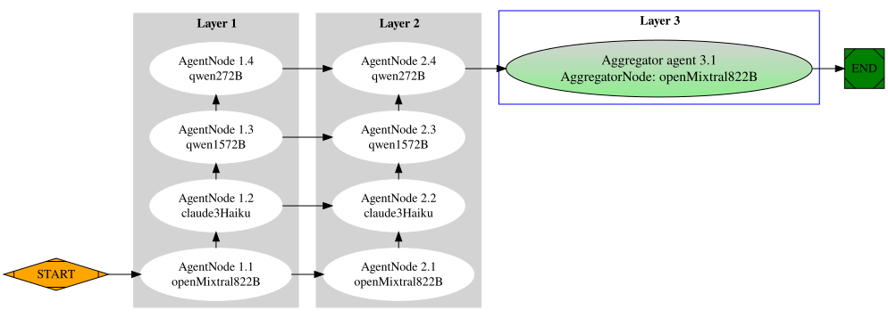
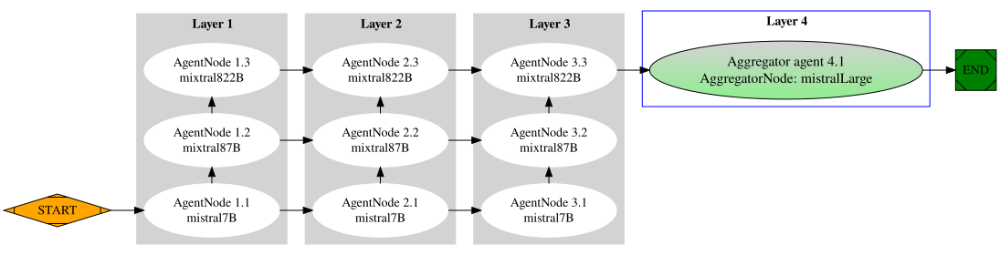

# LangChain4j - Mixture of Agents (MoA)

## Overview
`langchain4j-moa` is a Java implementation of the Mixture of Agents (MOA) concept, as described in the relevant [AI research paper](https://arxiv.org/pdf/2406.04692). It leverages the `langchain4j-workflow` and `langchain4j` libraries to provide a robust and efficient solution. 

The Mixture-of-Agents methodology leverages multiple models to boost performance, capitalizing on the collaborative nature of Large Language Models (LLMs). LLMs can be categorized into two roles: Proposers and Aggregators. Proposers generate useful reference responses, providing context and diverse perspectives. 
Aggregators synthesize responses from other models into a single, high-quality answer. This leads to superior outcomes by leveraging the strengths of multiple models.


_<center>Fig 1. Mixture of Agents (MoA) structure generate better answer than GPT-4o using opens-source LLMs.</center>_

## How it works
1. Define the number of layers in the MoA, this iterative refinement process continues for several cycles until obtaining a more
   robust and comprehensive response.
2. Define a list of reference LLMs as proposers, which generate reference responses to a given question and will be presented
   to agents in the next layer (may reuse same LLM from the first layer until the last layer).
3. Define an aggregator model, which synthesizes responses from proposers into a single, high-quality answer.

## How to use
To use `langchain4j-moa`, you need to instance the `MixtureOfAgents` interface. You can use `DefaultMixtureOfAgents` class to get quickly a completeness implementation.

This interface has two methods: `answer` and `answerStream` to get the final high-quality answer. The `answer` method is used to answer a question in normal mode, while the `answerStream` method is used to answer a question in streaming mode.

1. Define the **number of layers** in the `DefaultMixtureOfAgents.builder().numberOfLayers(<int>)`. The number of layers is the number of times the MoA will iterate over the reference LLMs to get a more robust and comprehensive response in a refinement process. It's recommended to use from 1 to 3 or 4 layers.  
2. Create a list of `ChatLanguageModel` objects, which represent the **reference LLMs** and added to the `AgentChatLaguageModel` object to be used in the `MixtureOfAgents` implementation. You can choose any LLM integration from the `langchain4j` lib.
3. Define the **aggregator model**, which synthesizes the previous responses to generate a single, high-quality answer. You can set:
    - `AggregatorChatLanguageModel` require an instance of `ChatLanguageModel` model type. You can reuse the one of the reference LLMs.
    - `AggregatorStreamingChatLanguageModel` require an instance of `StramingChatLanguageModel` model type and you define any streaming model integration from the `langchain4j` lib.

In addition to these basic steps, `DefaultMixtureOfAgents` implementation also provides several optional args to custom workflow execution. You can set:
- **Stream Flag**: This optional flag enables streaming the workflow node by node. By default, it is set to false.

- **GenerateWorkflowImage Flag**: This optional flag allows you to generate a workflow image using Graphviz default settings. By default, it is set to false.

- **WorkflowImageOutputPath**: This optional setting allows you to save the workflow image to a given path. By default, it is null. If it is set, and the `generateWorkflowImage` flag is set to true, the system will save the workflow image to the given path.


## Example
Here is a simple example of how to use the `langchain4j-moa` module::

```java
// 1. Define your reference models
ChatLanguageModel openMixtral822B = MistralAiChatModel.builder()
        .apiKey(getenv("MISTRAL_AI_API_KEY"))
        .modelName(MistralAiChatModelName.OPEN_MIXTRAL_8X22B)
        .temperature(0.7)
        .build();

ChatLanguageModel claude3Haiku = AnthropicChatModel.builder()
        .apiKey(getenv("ANTHROPIC_API_KEY"))
        .build();

ChatLanguageModel qwen1572B = QwenChatModel.builder()
        .apiKey(getenv("DASHSCOPE_API_KEY"))
        .modelName(QwenModelName.QWEN1_5_72B_CHAT)
        .build();

ChatLanguageModel qwen272B = QwenChatModel.builder()
        .apiKey(getenv("DASHSCOPE_API_KEY"))
        .modelName(QwenModelName.QWEN2_72B_INSTRUCT)
        .build();

// 2. Parse them to agent class
List<AgentChatLanguageModel> refLlms = Arrays.asList(
        AgentChatLanguageModel.from("openMixtral822B", openMixtral822B),
        AgentChatLanguageModel.from("claude3Haiku", claude3Haiku),
        AgentChatLanguageModel.from("qwen1572B", qwen1572B),
        AgentChatLanguageModel.from("qwen272B", qwen272B)
);

// 3. Define your aggregator model
AggregatorChatLanguageModel aggregatorModel = AggregatorChatLanguageModel.from(
        "openMixtral822B",
        openMixtral822B);

// 4. Create your mixture of agents
MixtureOfAgents moa = DefaultMixtureOfAgents.builder()
        .refLlms(refLlms)
        .numberOfLayers(2) // If it's not defined. Default 1
        .generateLlm(aggregatorModel)
        //.stream(true) // Optional, by default it is false, if true it will stream the workflow node by node
        //.generateWorkflowImage(true) // Optional, by default it is false, if true it will generate a workflow image using Graphviz default settings
        //.workflowImageOutputPath(Paths.get("moa-workflow.svg")) // Optional, by default it is null. If it is set, it will save the workflow image to the given path and generateWorkflowImage is set to true
        .build();

// Use the mixture of agents to answer a question
String question = "Top things to do in NYC";
String answer = moa.answer(question);
```
Console
```shell
2024-07-10 23:01:59 [main] dev.langchain4j.moa.internal.DefaultMixtureOfAgents.moaWorkflow()
INFO: === Generating MOA architecture.. ===
2024-07-10 23:01:59 [main] dev.langchain4j.moa.internal.DefaultMixtureOfAgents.lambda$moaWorkflow$2()
DEBUG:   === Created Layer: [1], Nodes added [4] ===
2024-07-10 23:01:59 [main] dev.langchain4j.moa.internal.DefaultMixtureOfAgents.lambda$moaWorkflow$2()
DEBUG:   === Created Layer: [2], Nodes added [4] ===
2024-07-10 23:01:59 [main] dev.langchain4j.moa.internal.DefaultMixtureOfAgents.moaWorkflow()
DEBUG:   === Created Aggregator Node ===
2024-07-10 23:01:59 [main] dev.langchain4j.moa.internal.DefaultMixtureOfAgents.moaWorkflow()
INFO: === MOA architecture generated ===
2024-07-10 23:01:59 [main] dev.langchain4j.moa.internal.DefaultMixtureOfAgents.moaWorkflow()
INFO:   === Layers: [2], Agents: [8] ===
2024-07-10 23:01:59 [main] dev.langchain4j.moa.internal.DefaultMixtureOfAgents.moaWorkflow()
INFO:   === Agent Aggregator: [AggregatorNode: openMixtral822B] ===
2024-07-10 23:01:59 [main] dev.langchain4j.moa.internal.DefaultMixtureOfAgents.moaWorkflow()
INFO: Parsing MOA architecture to workflow...
2024-07-10 23:01:59 [main] dev.langchain4j.workflow.DefaultStateWorkflow.run()
DEBUG: STARTING workflow in normal mode..
2024-07-10 23:01:59 [main] dev.langchain4j.workflow.DefaultStateWorkflow.runNode()
DEBUG: Running node name: AgentNode 1.1: openMixtral822B..
2024-07-10 23:01:59 [main] dev.langchain4j.moa.workflow.MoaNodeFunctions.proposerAgent()
INFO: ---PROPOSER AGENT: Layer (1), AgentModel: openMixtral822B---
2024-07-10 23:01:59 [main] dev.langchain4j.workflow.DefaultStateWorkflow.runNode()
DEBUG: Running node name: AgentNode 1.2: claude3Haiku..
2024-07-10 23:02:10 [main] dev.langchain4j.moa.workflow.MoaNodeFunctions.proposerAgent()
INFO: ---PROPOSER AGENT: Layer (1), AgentModel: claude3Haiku---
2024-07-10 23:02:15 [main] dev.langchain4j.workflow.DefaultStateWorkflow.runNode()
DEBUG: Running node name: AgentNode 1.3: qwen1572B..
2024-07-10 23:02:15 [main] dev.langchain4j.moa.workflow.MoaNodeFunctions.proposerAgent()
INFO: ---PROPOSER AGENT: Layer (1), AgentModel: qwen1572B---
2024-07-10 23:02:20 [main] dev.langchain4j.workflow.DefaultStateWorkflow.runNode()
DEBUG: Running node name: AgentNode 1.4: qwen272B..
2024-07-10 23:02:20 [main] dev.langchain4j.moa.workflow.MoaNodeFunctions.proposerAgent()
INFO: ---PROPOSER AGENT: Layer (1), AgentModel: qwen272B---
2024-07-10 23:02:28 [main] dev.langchain4j.workflow.DefaultStateWorkflow.runNode()
DEBUG: Running node name: AgentNode 2.1: openMixtral822B..
2024-07-10 23:02:28 [main] dev.langchain4j.moa.workflow.MoaNodeFunctions.proposerAgent()
INFO: ---PROPOSER AGENT: Layer (2), AgentModel: openMixtral822B---
2024-07-10 23:02:34 [main] dev.langchain4j.workflow.DefaultStateWorkflow.runNode()
DEBUG: Running node name: AgentNode 2.2: claude3Haiku..
2024-07-10 23:02:34 [main] dev.langchain4j.moa.workflow.MoaNodeFunctions.proposerAgent()
INFO: ---PROPOSER AGENT: Layer (2), AgentModel: claude3Haiku---
2024-07-10 23:02:41 [main] dev.langchain4j.workflow.DefaultStateWorkflow.runNode()
DEBUG: Running node name: AgentNode 2.3: qwen1572B..
2024-07-10 23:02:41 [main] dev.langchain4j.moa.workflow.MoaNodeFunctions.proposerAgent()
INFO: ---PROPOSER AGENT: Layer (2), AgentModel: qwen1572B---
2024-07-10 23:02:46 [main] dev.langchain4j.workflow.DefaultStateWorkflow.runNode()
DEBUG: Running node name: AgentNode 2.4: qwen272B..
2024-07-10 23:02:46 [main] dev.langchain4j.moa.workflow.MoaNodeFunctions.proposerAgent()
INFO: ---PROPOSER AGENT: Layer (2), AgentModel: qwen272B---
2024-07-10 23:02:55 [main] dev.langchain4j.workflow.DefaultStateWorkflow.runNode()
DEBUG: Running node name: AggregatorNode: openMixtral822B..
2024-07-10 23:02:55 [main] dev.langchain4j.moa.workflow.MoaNodeFunctions.aggregatorAgent()
INFO: ---AGGREGATE MODEL: dev.langchain4j.moa.AggregatorChatLanguageModel---
2024-07-10 23:03:02 [main] dev.langchain4j.workflow.DefaultStateWorkflow.runNode()
DEBUG: Reached END state
2024-07-10 23:03:02 [main] dev.langchain4j.moa.internal.DefaultMixtureOfAgents.processQuestion()
DEBUG: Transitions:
 
START -> AgentNode 1.1: openMixtral822B -> AgentNode 1.2: claude3Haiku -> AgentNode 1.3: qwen1572B -> AgentNode 1.4: qwen272B -> AgentNode 2.1: openMixtral822B -> AgentNode 2.2: claude3Haiku -> AgentNode 2.3: qwen1572B -> AgentNode 2.4: qwen272B -> AggregatorNode: openMixtral822B -> END

2024-07-10 23:03:02 [main] dev.langchain4j.workflow.graph.graphviz.GraphvizImageGenerator.generateImage()
DEBUG: Generating workflow image..
2024-07-10 23:03:02 [main] dev.langchain4j.workflow.graph.graphviz.GraphvizImageGenerator.generateImage()
DEBUG: Using default image format: SVG
2024-07-10 23:03:02 [main] dev.langchain4j.workflow.graph.graphviz.GraphvizImageGenerator.generateImage()
2024-07-10 23:03:02 [main] dev.langchain4j.workflow.graph.graphviz.GraphvizImageGenerator.generateImage()
DEBUG: Saving workflow image..
2024-07-10 23:03:13 [main] dev.langchain4j.workflow.graph.graphviz.GraphvizImageGenerator.generateImage()
DEBUG: Workflow image saved to: /Users/CarlosZela1/langchain4j-workflow-examples/langchain4j-moa/images/moa-wf-4.svg

INFO: Final Answer:

New York City, affectionately known as the "Big Apple" or the "City That Never Sleeps," is a vibrant metropolis offering an array of attractions and activities. To make the most of your visit, consider these top highlights:

1. **Statue of Liberty and Ellis Island**: These iconic landmarks offer a glimpse into America's rich history as a nation of immigrants. Take a ferry from Battery Park and explore the museums on both islands.

2. **Central Park**: This expansive urban park is perfect for leisurely strolls, picnics, or even boat rides. Notable spots include Strawberry Fields, the Central Park Zoo, and Bethesda Fountain.

3. **Metropolitan Museum of Art**: Known as "The Met," this world-class museum houses a vast collection of art and artifacts spanning 5,000 years of human history.

4. **Times Square**: Known as "The Crossroads of the World," this commercial and entertainment district is famous for its bright lights, Broadway shows, and towering billboards.

5. **Brooklyn Bridge**: Walking across this iconic bridge offers stunning views of Manhattan and Brooklyn, especially beautiful at sunset.

6. **9/11 Memorial and Museum**: This tribute of remembrance and honor to the nearly 3,000 people killed in the September 11, 2001 attacks is a moving and important historical site.

7. **Empire State Building**: This Art Deco skyscraper offers panoramic views of the city from its observation decks on the 86th and 102nd floors.

8. **High Line**: This elevated park, built on a former railway line, offers a unique perspective of the city and the Hudson River.

9. **Museum of Modern Art (MoMA)**: This museum houses an extensive collection of modern and contemporary art, a must-visit for any art lover.

10. **Broadway Shows**: No visit to NYC is complete without seeing a Broadway show. From classic musicals to groundbreaking plays, there's something for everyone.

To fully enjoy these experiences, consider purchasing a sightseeing pass or creating a well-planned itinerary to make the most of your time in this bustling city.'}

```
## Streaming example

```java
// same reference models than above
// ...
StreamingChatLanguageModel streamingAnthropic = AnthropicStreamingChatModel.builder()
        .apiKey(getenv("ANTHROPIC_API_KEY"))
        .logRequests(true)
        .logResponses(true)
        .build();

// Define your aggregator model
AggregatorChatStreamingLanguageModel aggregatorStreamingModel = AggregatorStreamingChatLanguageModel.from(
        "streamingAnthropic",
        streamingAnthropic);

// Create your mixture of agents
MixtureOfAgents moa = DefaultMixtureOfAgents.builder()
        .refLlms(refLlms)
        .numberOfLayers(3) // If it's not defined. Default 1
        .generateLlmStreaming(aggregatorStreamingModel)
        //.stream(true) // Optional, by default it is false, if true it will stream the workflow node by node
        //.generateWorkflowImage(true) // Optional, by default it is false, if true it will generate a workflow image using Graphviz default settings
        .workflowImageOutputPath(Paths.get("images/moa-wf-3.svg")) // Optional, by default it is null. If it is set, it will save the workflow image to the given path and generateWorkflowImage is set to true
        .build();

// Use the mixture of agents to answer a question
String question = "Top things to do in NYC";
List<String> finalStream = moa.answerStream(question);

// Get chunk messages from the streaming response
for (String chunk : finalStream) {
    System.out.println(chunk);
}
```
Console
```shell
2024-07-07 19:31:26 [main] dev.langchain4j.moa.internal.DefaultMixtureOfAgents.moaWorkflow()
INFO: === Generating MOA architecture.. ===
2024-07-07 19:31:26 [main] dev.langchain4j.moa.internal.DefaultMixtureOfAgents.lambda$moaWorkflow$2()
DEBUG:   === Created Layer: [1], Nodes added [3] ===
2024-07-07 19:31:26 [main] dev.langchain4j.moa.internal.DefaultMixtureOfAgents.lambda$moaWorkflow$2()
DEBUG:   === Created Layer: [2], Nodes added [3] ===
2024-07-07 19:31:26 [main] dev.langchain4j.moa.internal.DefaultMixtureOfAgents.moaWorkflow()
DEBUG:   === Created Aggregator Node ===
2024-07-07 19:31:26 [main] dev.langchain4j.moa.internal.DefaultMixtureOfAgents.moaWorkflow()
INFO: === MOA architecture generated ===
2024-07-07 19:31:26 [main] dev.langchain4j.moa.internal.DefaultMixtureOfAgents.moaWorkflow()
INFO:   === Layers: [2], Agents: [6] ===
2024-07-07 19:31:26 [main] dev.langchain4j.moa.internal.DefaultMixtureOfAgents.moaWorkflow()
INFO:   === Agent Aggregator: [AggregatorStreamingNode: streamingAnthropic] ===
2024-07-07 19:31:26 [main] dev.langchain4j.moa.internal.DefaultMixtureOfAgents.moaWorkflow()
INFO: Parsing MOA architecture to workflow...
2024-07-07 19:31:26 [main] dev.langchain4j.moa.internal.DefaultMixtureOfAgents.processQuestion()
INFO: Running workflow in normal mode...
2024-07-07 19:31:26 [main] dev.langchain4j.workflow.DefaultStateWorkflow.run()
DEBUG: STARTING workflow in normal mode..
2024-07-07 19:31:26 [main] dev.langchain4j.workflow.DefaultStateWorkflow.runNode()
DEBUG: Running node name: AgentNode 1.1: mistral7B..
2024-07-07 19:31:26 [main] dev.langchain4j.moa.workflow.MoaNodeFunctions.proposerAgent()
INFO: ---PROPOSER AGENT: Layer (1), AgentModel: mistral7B---
2024-07-07 19:31:32 [main] dev.langchain4j.workflow.DefaultStateWorkflow.runNode()
DEBUG: Running node name: AgentNode 1.2: mixtral87B..
2024-07-07 19:31:32 [main] dev.langchain4j.moa.workflow.MoaNodeFunctions.proposerAgent()
INFO: ---PROPOSER AGENT: Layer (1), AgentModel: mixtral87B---
2024-07-07 19:31:32 [main] dev.langchain4j.moa.workflow.MoaNodeFunctions.proposerAgent()
2024-07-07 19:31:37 [main] dev.langchain4j.workflow.DefaultStateWorkflow.runNode()
DEBUG: Running node name: AgentNode 1.3: mixtral822B..
2024-07-07 19:31:37 [main] dev.langchain4j.moa.workflow.MoaNodeFunctions.proposerAgent()
INFO: ---PROPOSER AGENT: Layer (1), AgentModel: mixtral822B---
2024-07-07 19:31:37 [main] dev.langchain4j.moa.workflow.MoaNodeFunctions.proposerAgent()
2024-07-07 19:31:43 [main] dev.langchain4j.workflow.DefaultStateWorkflow.runNode()
DEBUG: Running node name: AgentNode 2.1: mistral7B..
2024-07-07 19:31:43 [main] dev.langchain4j.moa.workflow.MoaNodeFunctions.proposerAgent()
2024-07-07 19:31:49 [main] dev.langchain4j.workflow.DefaultStateWorkflow.runNode()
DEBUG: Running node name: AgentNode 2.2: mixtral87B..
2024-07-07 19:31:49 [main] dev.langchain4j.moa.workflow.MoaNodeFunctions.proposerAgent()
INFO: ---PROPOSER AGENT: Layer (2), AgentModel: mixtral87B---
2024-07-07 19:31:49 [main] dev.langchain4j.moa.workflow.MoaNodeFunctions.proposerAgent()
2024-07-07 19:31:55 [main] dev.langchain4j.workflow.DefaultStateWorkflow.runNode()
DEBUG: Running node name: AgentNode 2.3: mixtral822B..
2024-07-07 19:31:55 [main] dev.langchain4j.moa.workflow.MoaNodeFunctions.proposerAgent()
INFO: ---PROPOSER AGENT: Layer (2), AgentModel: mixtral822B---
2024-07-07 19:31:55 [main] dev.langchain4j.moa.workflow.MoaNodeFunctions.proposerAgent()
2024-07-07 19:32:00 [main] dev.langchain4j.workflow.DefaultStateWorkflow.runNode()
DEBUG: Running node name: AggregatorStreamingNode: streamingAnthropic..
2024-07-07 19:32:00 [main] dev.langchain4j.moa.workflow.MoaNodeFunctions.aggregatorStreamingAgent()
INFO: ---AGGREGATE STREAM MODEL: dev.langchain4j.moa.AggregatorStreamingChatLanguageModel---
2024-07-07 19:32:00 [main] dev.langchain4j.moa.workflow.MoaNodeFunctions.aggregatorStreamingAgent()
2024-07-07 19:32:00 [main] dev.langchain4j.moa.workflow.MoaNodeFunctions.aggregatorStreamingAgent()
INFO: ==== Printing Streaming response ==== 
2024-07-07 19:32:00 [OkHttp https://api.anthropic.com/...] dev.langchain4j.model.anthropic.internal.client.AnthropicRequestLoggingInterceptor.log()
DEBUG: Request:
- method: POST
- url: https://api.anthropic.com/v1/messages
- headers: [x-api-key: sk-an...AA], [anthropic-version: 2023-06-01], [Accept: text/event-stream]
- body: {
  "model" : "claude-3-haiku-20240307",
  "messages" : [ {
    "role" : "user",
    "content" : [ {
      "type" : "text",
      "text" : "Top things to do in NYC"
    } ]
  } ],
  "system" : "You have been provided with a set of responses ...",
  "max_tokens" : 1024,
  "stream" : true
}
2024-07-07 19:32:01 [OkHttp https://api.anthropic.com/...] dev.langchain4j.model.anthropic.internal.client.AnthropicResponseLoggingInterceptor.log()
DEBUG: Response:
- status code: 200
- headers: [date: Sun, 07 Jul 2024 23:32:01 GMT], [content-type: text/event-stream; charset=utf-8], [cache-control: no-cache], [anthropic-ratelimit-requests-limit: 50], [anthropic-ratelimit-requests-remaining: 49], [anthropic-ratelimit-requests-reset: 2024-07-07T23:32:22Z], [anthropic-ratelimit-tokens-limit: 50000], [anthropic-ratelimit-tokens-remaining: 47000], [anthropic-ratelimit-tokens-reset: 2024-07-07T23:32:04Z], [request-id: req_01DJBgyAbRhKccNxHEpEgzTE], [via: 1.1 google], [cf-cache-status: DYNAMIC], [server: cloudflare], [cf-ray: 89fba1a25df47151-YUL]
- body: [skipping response body due to streaming]

2024-07-07 19:32:04 [main] dev.langchain4j.workflow.DefaultStateWorkflow.runNode()
DEBUG: Reached END state
2024-07-07 19:32:04 [main] dev.langchain4j.moa.internal.DefaultMixtureOfAgents.processQuestion()
DEBUG: Transitions: 
START -> AgentNode 1.1: mistral7B -> AgentNode 1.2: mixtral87B -> AgentNode 1.3: mixtral822B -> AgentNode 2.1: mistral7B -> AgentNode 2.2: mixtral87B -> AgentNode 2.3: mixtral822B -> AggregatorStreamingNode: streamingAnthropic -> END
2024-07-07 19:32:04 [OkHttp https://api.anthropic.com/...] dev.langchain4j.model.anthropic.internal.client.DefaultAnthropicClient.onClosed()
DEBUG: onClosed()

New York City is indeed one of the most exciting and vibrant cities in the world, offering a wide array of activities and attractions for visitors. Here are the top things to do in NYC that you shouldn't miss:

1. Statue of Liberty and Ellis Island: Be sure to visit these iconic landmarks by taking a ferry from Battery Park. The ferry ticket usually includes access to both islands.
2. Central Park: Spend some time exploring this 843-acre park in the heart of the city. You can relax, have a picnic, go for a run, or rent a boat. Don't forget to check out the Central Park Zoo and the Bethesda Terrace.
3. Brooklyn Bridge: Walking across the Brooklyn Bridge is a must-do experience. The bridge offers stunning views of the city skyline and the Statue of Liberty.
4. Metropolitan Museum of Art: This world-renowned museum houses a vast collection of art from around the world, spanning 5,000 years of history. Be sure to check out the museum's permanent collection as well as its temporary exhibitions.
5. Broadway Show: Seeing a Broadway show is an unforgettable experience. There are various shows to choose from, ranging from long-running classics to new productions.
6. Times Square: While it can be crowded and touristy, Times Square is still worth a visit. You can do some shopping, dining, or watch street performers.
7. 9/11 Memorial and Museum: This powerful memorial honors the victims of the 9/11 attacks. The museum provides a moving and informative look at the events of that day.
8. Empire State Building: The observation deck on the 86th floor offers stunning views of the city. It's best to visit during sunset for a breathtaking view.
9. Food Tour: NYC is known for its diverse and delicious food scene. Take a food tour to explore the city's best eats, from classic New York-style pizza to traditional Jewish deli food.
10. Museum of Modern Art (MoMA): This world-class museum houses an impressive collection of modern and contemporary art, including works by Picasso, Warhol, and Van Gogh.
```

If generateWorkflowImage is set to `true`, the system will generate an image of the workflow execution. Here is an example of the workflow image generated for the above example:

> **Remember**: Generate an image of the workflow execution is optional, and it can add more latency. If you want to generate an image of the workflow execution, you need to set the `generateWorkflowImage` flag to `true` and, if you want to save the image to a specific path, you need to set the `workflowImageOutputPath` to the desired path.




Enjoy!

@c_zela
